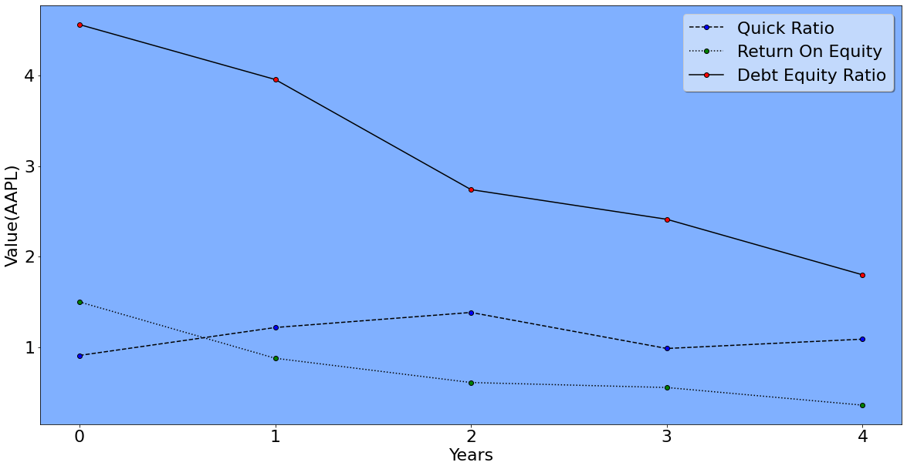
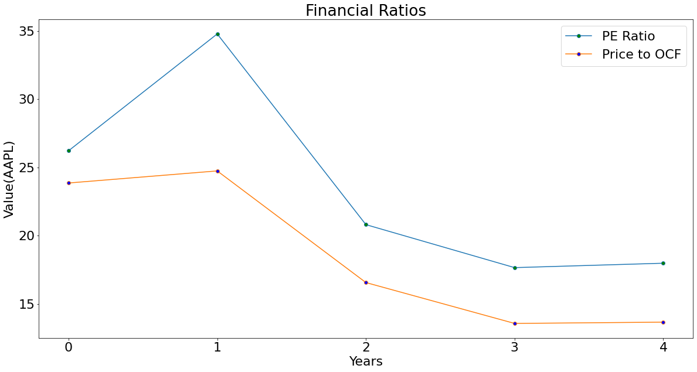

# Finance related Projects I've been working on

My working Finance projects to showcase my skills and knowledge

As the models are already created we just need to change "AAPL" with the ticker symbol of the required company

1. Apple Stock Price Prediction - It uses LSTM(Long Short Term Memory) model to predict the price of stock one day in advance.
.

The orange line shows the actual price and the orange one is the predicted price, 

######I learnt this method through youtube.

2. Financial Ratios Analysis. 

Here are some examples of the Financial Ratios Analysis done in python, 
Python makes it very easy to practically retrieve any financial ratio of any company within minutes for any company,
I also use an api from https://site.financialmodelingprep.com/ which makes things even easier.

Here are the Quick Ratio, ROE and Debt Ratio for AAPL for the past five years

Another ratio analysis for AAPL.

